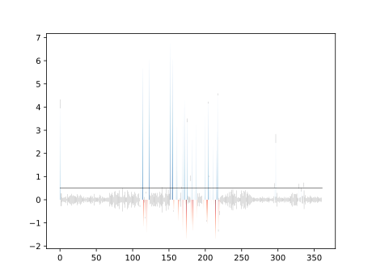

# Conservation score

Using different types of matrices we can represent conservation within an alignment, given the prior information of a pair of groups within the alignment.

We will also use different substitution matrices based on external structural information.

Finally we will try to map the score for each position in a 3D object, by prodcuing a .pml file and a bar graph.

## Overall flow

1. Inputs
- One alignment file with two defined groups (Required)
	- or optional tree file instead of defined groups...
- One or two structure files for each group, or secondary structure string (Optional)
	- Structure files must each correspond to a sequence from the their appropriate sequence group, sequences must have same length between structure and alignment or the correct numbering must be used in the structure files.

2. Flow
- Read alignment and structure files
- Split the alignment into two groups 
	- or split alignment in multiple groups by traversing the tree.
- Parse matrices
	- Transform to log odds
	- Normalize random to 0
- Create group classes
	- Create correspondence mapping between alignment index and anchor sequences for the groups.
	- Calculate structural data and associate with correspondence mapping (sec structure and inner/outer)
	- Randomize gaps in alignment objects
	- Calculate frequency vectors and associate with correspondence mapping 
- For combinations of two classes:
	- Calculate score using **frequency vectors**, **correspondence mapping**, and **matrices** defined by **structural data**
- Generate output
	- **.pml file** for all structures with residue colors defined by the score
	- **.svg** with score trace for residue number
	- **optional data** if run as a module **for multiple alignment analysis**

## Dependencies

- Python3
- Python modules:
	- Biopython
- DSSP 
- MSMS http://mgltools.scripps.edu/downloads#msms

## Other

Sample output

