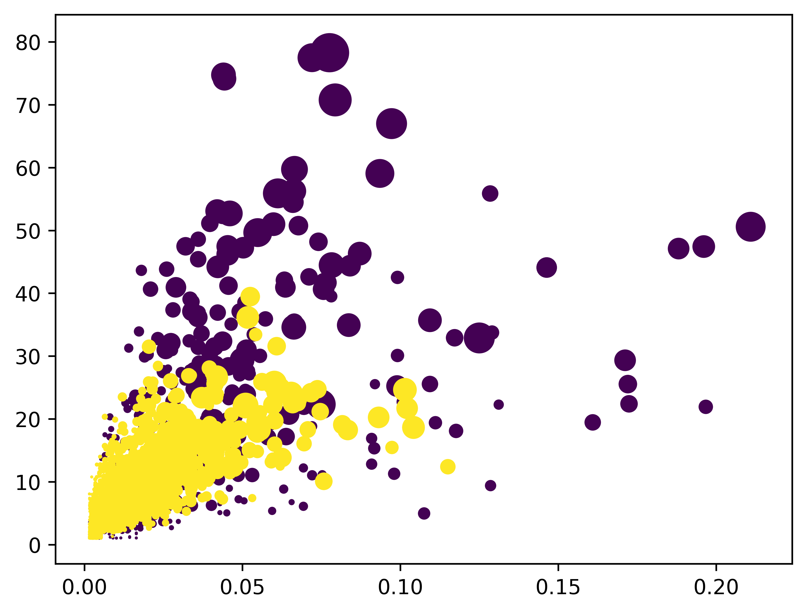
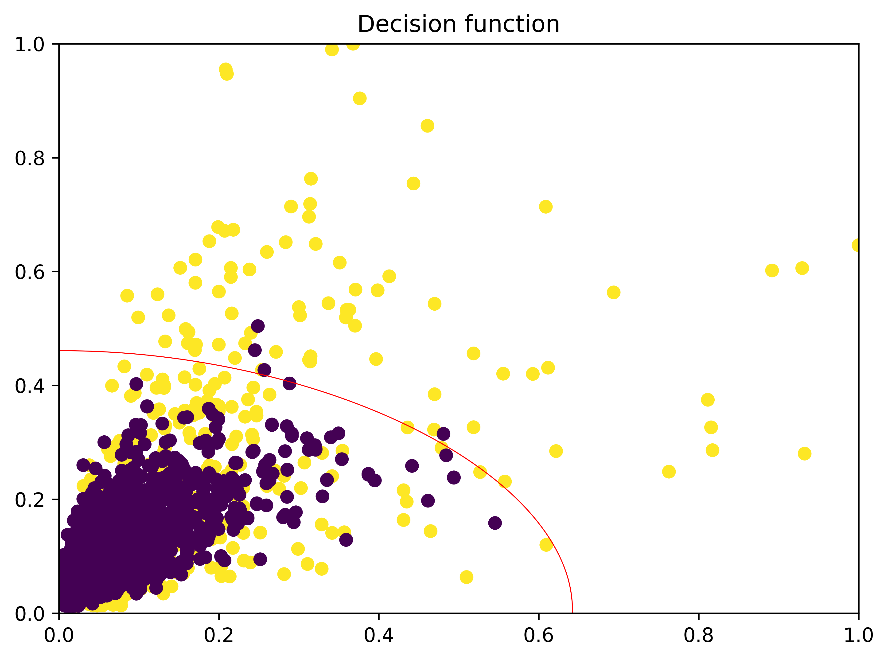
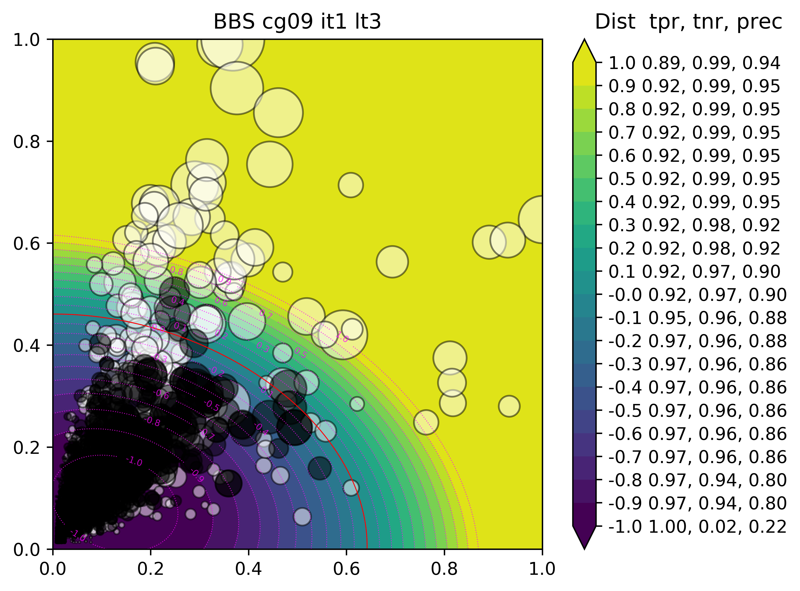

# Conservation score

Using different types of matrices we can represent conservation within an alignment, given the prior information of a pair of groups within the alignment.

We will also use different substitution matrices based on external structural information.

Finally we will try to map the score for each position in a 3D object, by producing a .pml file and a bar graph.

## Overall flow

1. Inputs
- One alignment file with two defined groups (Required)
	- or optional tree file instead of defined groups...
- One or two structure files for each group, or secondary structure string (Optional)
	- Structure files must each correspond to a sequence from the their appropriate sequence group, sequences must have same length between structure and alignment or the correct numbering must be used in the structure files.

2. Flow
- Read alignment and structure files
- Split the alignment into two groups 
	- or split alignment in multiple groups by traversing the tree.
- Parse matrices
	- Transform to log odds
	- Normalize random to 0
- Create group classes
	- Create correspondence mapping between alignment index and anchor sequences for the groups.
	- Calculate structural data and associate with correspondence mapping (sec structure and inner/outer)
	- Randomize gaps in alignment objects
	- Calculate frequency vectors and associate with correspondence mapping 
- For combinations of two classes:
	- Calculate score using **frequency vectors**, **correspondence mapping**, and **matrices** defined by **structural data**
- Generate output
	- **.pml file** for all structures with residue colors defined by the score
	- **.svg** with score trace for residue number
	- **optional data** if run as a module **for multiple alignment analysis**

## Dependencies

- Python3
- Python modules:
	- Biopython
- DSSP 
- MSMS http://mgltools.scripps.edu/downloads#msms

## Other

Sample output

# Multiple alignment analysis

CalculateSegments.py executes the TwinCons.py code for a given folder with sequence alignments. Calculates length, weight, normalized lengths and positions of high scoring segments from the results of TwinCons.

Tries to guess the type of comparison and color code the included datasets. For lower number of alignments (up to 20) applies different color for each alignment. For greater number of alignments tagged in different groups (e.g. A_alignment-nameX.fas, B_alignment-nameY.fas and so on), uses the viridis colormap to color each group of alignments together. For exactly 10 alignments in a folder assumes they are ordered by similarity and colors them with a Purple Green gradient.

Can pass all options for calculation already present in TwinCons with the option -co. However, as of now it does not support structure mapping of scores or using structure defined matrices. 

It does support the options: **-gt**, **-cg**, **-phy**, [**-lg**, **-bl**, **-e**, **-c**]. Should be passed as separate arguments after the flag -co without the dashes and underscore for flags with parameters. -co should be the last argument passed to CalculateSegments.py since any argument following -co will be passed to TwinCons.py. For example:

	./bin/CalculateSegments.py ./folder_with_alignments/ ./output_file -c -t 1 -co cg gt_0.9 phy bl

Sample output:

# Analyzing TWC results

## Training a classifier

## Testing a classifier

### Average distance
In the case of large segments there will be few segments and they will be far away from the boundary => cost nearing 0. In the case of many small segments their distance to the boundary will be accumulated resulting in big negative number (larger than any segment can attain on it's own) => cost nearing infinity.

### Identifying significant segments

